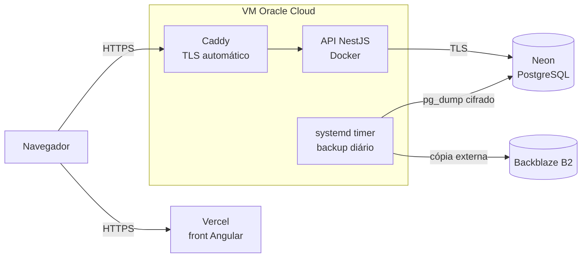

# Escola Imaculada — API

Diário de classe digital da **Escola Imaculada**, uma escola de educação
infantil. O sistema substitui o caderno de chamada e os registros em papel:
professoras lançam presença, conteúdo e avaliações das suas turmas, e a
direção acompanha a escola inteira e emite os relatórios oficiais.

Projeto desenvolvido de forma voluntária e em uso real pela escola. Este
repositório contém a API; a interface está em
[EscolaImaculada-frontend](https://github.com/guiGocksAfK/EscolaImaculada-frontend).

## Funcionalidades

- **Dois perfis de acesso.** A diretora administra a escola inteira; cada
  professora enxerga apenas as turmas pelas quais é responsável.
- **Chamada diária e visão mensal**, com presença, falta e desistência. Uma
  chamada lançada não pode ser sobrescrita por engano.
- **Faltas justificadas**, aceitas apenas sobre faltas de fato registradas na
  chamada do dia.
- **Registro de conteúdo** estruturado pelos campos de experiência da BNCC
  para a educação infantil.
- **Avaliações descritivas** por aluno e por período.
- **Relatórios**: resumo anual de frequência por aluno e registro semestral da
  turma.
- **Gestão da escola**: turmas, alunos (ativo, transferido, desistente) e
  contas das professoras.
- **Trilha de auditoria** de toda operação de escrita, consultável pela
  direção.
- **Multi-escola**: cada escola é um espaço isolado; nenhum dado cruza de uma
  para outra.

## Arquitetura e hospedagem



| Componente | Onde roda | Observações |
|---|---|---|
| Frontend | Vercel | SPA Angular servida com CSP e headers de segurança. |
| API | VM Oracle Cloud (ARM64), em Docker | Atrás do Caddy, que emite e renova o certificado TLS. Container sem privilégio de root. |
| Banco | Neon (PostgreSQL, região São Paulo) | Conexão com TLS obrigatório; point-in-time recovery do próprio Neon. |
| Backups | VM + Backblaze B2 | Ver [Backups](#backups). |

Alguns detalhes de operação:

- **Migrations automáticas no deploy**: o comando de produção aplica as
  migrations pendentes antes de subir a API.
- **Configuração validada no boot**: em produção a API se recusa a iniciar com
  segredo fraco, CORS ou banco apontando para `localhost`, ou proxy reverso
  não declarado. Um erro de configuração falha no deploy, não em uso.
- **Imagem enxuta**: build em múltiplos estágios, sem dependências de
  desenvolvimento na imagem final.

Toda a infraestrutura roda em planos gratuitos; o armazenamento no B2 custa
centavos por mês.

O passo a passo de deploy e operação da VM está em
[deploy/README.md](./deploy/README.md).

## Backups

Os dados são de crianças e de uma escola real, então o backup foi tratado como
parte do produto, e não como um detalhe. São três camadas, cada uma cobrindo a
falha da anterior:

| Camada | Cobre | Não cobre |
|---|---|---|
| Point-in-time recovery do Neon | Erro recente ("apaguei agora") | Perda de acesso à conta do Neon |
| Dump diário na VM (14 dias) | Banco perdido, migration ruim, exclusão descoberta semanas depois | Perda da VM |
| Cópia no Backblaze B2 | Perda da VM ou da conta na Oracle | Perda da chave privada de cifragem |

- **Cifrado na origem.** O dump é comprimido e cifrado com
  [age](https://age-encryption.org); a VM guarda apenas a chave pública. Nem
  quem invadir o servidor consegue ler os backups.
- **Imutável no destino.** O bucket no B2 usa Object Lock: nenhuma chave,
  nem a da própria VM, apaga o histórico antes do prazo de retenção.
- **Falha não passa despercebida.** O script avisa um *dead man's switch*
  ([healthchecks.io](https://healthchecks.io)) ao terminar; se o backup parar
  de rodar ou quebrar, chega um alerta.
- **Nunca grava backup pela metade.** O arquivo só recebe o nome definitivo
  depois que o dump termina inteiro, e dumps suspeitamente pequenos são
  descartados.
- **Restauração testada.** Um dump real foi decifrado, restaurado num Postgres
  limpo e validado com login e conferência das contagens. O roteiro está
  documentado e a data do último teste fica registrada.

Roteiro completo de instalação e restauração:
[deploy/README.md](./deploy/README.md#backup-e-restauração).

## Stack

| Camada | Tecnologia |
|---|---|
| Runtime | Node.js 24, TypeScript |
| Framework | NestJS 12 |
| Banco e ORM | PostgreSQL + Prisma 7 (driver adapter `pg`) |
| Autenticação | JWT (Passport) e bcrypt |
| Validação | class-validator / class-transformer |
| Qualidade | oxlint, Prettier, suíte de smoke em shell |
| Infraestrutura | Docker, Caddy, systemd |
| Backup | pg_dump, age, rclone, Backblaze B2, healthchecks.io |

## Segurança

Resumo do que está em vigor. O detalhamento, com o raciocínio de cada decisão
e as limitações conhecidas, está em [SECURITY.md](./SECURITY.md).

- **Autenticação obrigatória por padrão.** Toda rota exige token, exceto as
  explicitamente públicas (login e nome da escola). A conta é conferida no
  banco a cada requisição: um acesso removido perde efeito imediatamente, sem
  esperar o token expirar.
- **Isolamento entre escolas e turmas** verificado em todas as operações, não
  apenas na listagem.
- **Senhas** com bcrypt (custo 12) e login resistente a ataque de tempo, que
  não revela se um CPF está cadastrado.
- **Rate limiting**, com limite mais rígido nas rotas de autenticação.
- **Validação estrita de entrada**: campos desconhecidos são rejeitados, todo
  texto tem tamanho máximo, CPF é validado pelo dígito verificador e datas
  precisam existir no calendário.
- **Dados pessoais protegidos nas respostas**: o CPF nunca sai completo da API.
- **Erros sem vazamento de detalhes internos** e headers de segurança via
  helmet.
- **Trilha de auditoria** de toda escrita, inclusive das tentativas negadas.

## Rodando localmente

Requisitos: Node.js 24 (npm 11) e Docker.

```bash
cp .env.example .env        # os valores padrão já funcionam em desenvolvimento
docker compose up -d        # Postgres local, exposto apenas em 127.0.0.1
npm install                 # também gera o client do Prisma
npx prisma migrate dev      # aplica as migrations
npm run start:dev           # API em http://localhost:3000
```

Para popular o banco com dados de demonstração (**apaga tudo antes de
recriar**, nunca use em produção):

```bash
npm run seed
```

### Scripts

| Script | Descrição |
|---|---|
| `npm run start:dev` | API com recarga automática. |
| `npm run build` | Compila para `dist/`. |
| `npm run start:prod` | Aplica as migrations e sobe a API compilada (comando de produção). |
| `npm run lint` | Análise estática com oxlint. |
| `npm run test:smoke` | Suíte de ponta a ponta contra a API rodando (ver abaixo). |

### Testes

A suíte de smoke (`test/smoke.sh`) exercita todos os módulos contra uma API
real, com mais de 100 verificações: regras de negócio, validação de entrada,
permissões por papel e isolamento entre escolas. Cada execução cria seus
próprios dados, então pode ser rodada repetidamente sem limpar o banco.

```bash
RATE_LIMIT_DISABLED=1 CADASTRO_INICIAL_ABERTO=1 npm run start:dev
npm run test:smoke          # em outro terminal
```

### Variáveis de ambiente

A lista completa e comentada está em [.env.example](./.env.example). As que
mudam entre desenvolvimento e produção:

| Variável | Desenvolvimento | Produção |
|---|---|---|
| `DATABASE_URL` | Postgres do `docker-compose.yml` | Banco gerenciado, com `sslmode=require` |
| `JWT_SECRET` | Qualquer valor com 32+ caracteres | Segredo exclusivo (`openssl rand -base64 48`) |
| `CORS_ORIGIN` | `http://localhost:4200` | Domínio(s) do frontend |
| `NODE_ENV` | (vazio) | `production`, que ativa as validações extras no boot |
| `TRUST_PROXY` | (vazio) | `1`, pois a API roda atrás do Caddy |

## Estrutura

```
src/
├── auth/                  login, cadastro inicial e estratégia JWT
├── common/                guards (auth, papéis, rate limit), validadores, controle de acesso
├── auditoria/             interceptor e consulta da trilha de auditoria
├── escola/  professoras/  turmas/  alunos/
├── chamada/  faltas-justificadas/  conteudo/  avaliacoes/
├── relatorios/            resumo anual e registro semestral
└── prisma/                conexão com o banco
prisma/                    schema, migrations e seed
deploy/                    compose de produção, script e timer de backup, runbook
test/                      suíte de smoke
```
