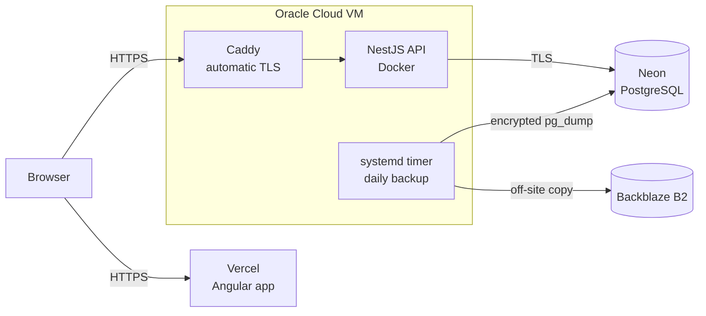

# Escola Imaculada — API

Digital class register for **Escola Imaculada**, an early childhood education
school in Brazil. The system replaces the paper attendance book and written
records: teachers log attendance, lesson content and assessments for their
classes, while the principal oversees the whole school and issues the official
reports.

Built pro bono and in real use by the school. This repository contains the
API; the web app lives in
[EscolaImaculada-frontend](https://github.com/guiGocksAfK/EscolaImaculada-frontend).

> Detailed operational and security docs ([SECURITY.md](./SECURITY.md),
> [deploy/README.md](./deploy/README.md)) are written in Portuguese.

## Features

- **Two access roles.** The principal manages the entire school; each teacher
  only sees the classes they are responsible for.
- **Daily attendance and monthly overview**, tracking present, absent and
  dropped-out students. Submitted attendance cannot be overwritten by mistake.
- **Excused absences**, accepted only for absences actually recorded that day.
- **Lesson records** structured around the fields of experience defined by the
  BNCC (Brazil's national curriculum framework) for early childhood education.
- **Narrative assessments** per student and per term.
- **Reports**: yearly attendance summary per student and the class's
  semester record.
- **School management**: classes, students (active, transferred, dropped out)
  and teacher accounts.
- **Audit trail** of every write operation, available to the principal.
- **Multi-tenant**: each school is an isolated space; no data crosses between
  schools.

## Architecture and hosting



| Component | Runs on | Notes |
|---|---|---|
| Frontend | Vercel | Angular SPA served with CSP and security headers. |
| API | Oracle Cloud VM (ARM64), in Docker | Behind Caddy, which issues and renews the TLS certificate. Container runs without root privileges. |
| Database | Neon (PostgreSQL, São Paulo region) | TLS required on every connection; Neon's own point-in-time recovery. |
| Backups | VM + Backblaze B2 | See [Backups](#backups). |

A few operational details:

- **Automatic migrations on deploy**: the production command applies pending
  migrations before starting the API.
- **Configuration validated at boot**: in production the API refuses to start
  with a weak secret, CORS or database pointing to `localhost`, or an
  undeclared reverse proxy. A misconfiguration fails the deploy, not the users.
- **Lean image**: multi-stage build, with no development dependencies in the
  final image.

The entire infrastructure runs on free tiers; B2 storage costs a few cents a
month.

The step-by-step deploy and VM operations guide is in
[deploy/README.md](./deploy/README.md).

## Backups

The data belongs to children and to a real school, so backups were treated as
part of the product rather than an afterthought. There are three layers, each
covering the failure of the previous one:

| Layer | Covers | Does not cover |
|---|---|---|
| Neon point-in-time recovery | Recent mistakes ("I just deleted it") | Losing access to the Neon account |
| Daily dump on the VM (14 days) | Lost database, bad migration, deletion noticed weeks later | Losing the VM |
| Copy on Backblaze B2 | Losing the VM or the Oracle account | Losing the private encryption key |

- **Encrypted at the source.** The dump is compressed and encrypted with
  [age](https://age-encryption.org); the VM only holds the public key. Even
  someone who breaks into the server cannot read the backups.
- **Immutable at the destination.** The B2 bucket uses Object Lock: no key,
  not even the VM's own, can delete history before the retention period ends.
- **Failures don't go unnoticed.** The script reports to a dead man's switch
  ([healthchecks.io](https://healthchecks.io)) when it finishes; if the backup
  stops running or breaks, an alert goes out.
- **Never writes a partial backup.** The file only gets its final name once
  the dump completes, and suspiciously small dumps are discarded.
- **Restore tested.** A real dump was decrypted, restored into a clean
  Postgres instance and validated by logging in and checking record counts.
  The procedure is documented and the date of the last test is recorded.

Full installation and restore guide:
[deploy/README.md](./deploy/README.md#backup-e-restauração).

## Tech stack

| Layer | Technology |
|---|---|
| Runtime | Node.js 24, TypeScript |
| Framework | NestJS 12 |
| Database and ORM | PostgreSQL + Prisma 7 (`pg` driver adapter) |
| Authentication | JWT (Passport) and bcrypt |
| Validation | class-validator / class-transformer |
| Quality | oxlint, Prettier, shell-based smoke suite |
| Infrastructure | Docker, Caddy, systemd |
| Backup | pg_dump, age, rclone, Backblaze B2, healthchecks.io |

## Security

A summary of what is in place. The full breakdown, including the reasoning
behind each decision and the known limitations, is in
[SECURITY.md](./SECURITY.md).

- **Authentication required by default.** Every route requires a token except
  those explicitly marked public (login and school name). The account is
  checked against the database on every request, so revoked access takes
  effect immediately instead of waiting for the token to expire.
- **Isolation between schools and classes** enforced on every operation, not
  just on listings.
- **Passwords** hashed with bcrypt (cost 12), and a timing-safe login that
  does not reveal whether a CPF (Brazilian taxpayer ID) is registered.
- **Rate limiting**, with a stricter limit on authentication routes.
- **Strict input validation**: unknown fields are rejected, every text field
  has a maximum length, CPFs are validated by their check digits and dates
  must exist on the calendar.
- **Personal data protected in responses**: CPFs never leave the API in full.
- **No internal details leaked in errors**, plus security headers via helmet.
- **Audit trail** of every write, including denied attempts.

## Running locally

Requirements: Node.js 24 (npm 11) and Docker.

```bash
cp .env.example .env        # defaults work out of the box for development
docker compose up -d        # local Postgres, bound to 127.0.0.1 only
npm install                 # also generates the Prisma client
npx prisma migrate dev      # applies migrations
npm run start:dev           # API at http://localhost:3000
```

To populate the database with demo data (**wipes everything first**, never
use in production):

```bash
npm run seed
```

### Scripts

| Script | Description |
|---|---|
| `npm run start:dev` | API with hot reload. |
| `npm run build` | Compiles to `dist/`. |
| `npm run start:prod` | Applies migrations and starts the compiled API (production command). |
| `npm run lint` | Static analysis with oxlint. |
| `npm run test:smoke` | End-to-end suite against the running API (see below). |

### Tests

Attendance integrity tests can also run against a disposable local PostgreSQL
database named with the `_test` suffix. Set `TEST_DATABASE_URL` and run
`npm test`. They create and remove isolated schemas, including migration
fixtures and concurrent writes; they never use `DATABASE_URL`.

Run `npm run build` and `npm test` for the security regression tests (no
database required).

The smoke suite (`test/smoke.sh`) exercises every module against a real API
with more than 100 checks: business rules, input validation, role
permissions and isolation between schools. Each run creates its own data, so
it can be run repeatedly without resetting the database.

```bash
export CADASTRO_INICIAL_TOKEN="$(openssl rand -hex 32)"
RATE_LIMIT_DISABLED=1 CADASTRO_INICIAL_ABERTO=1 npm run start:dev
npm run test:smoke          # in another terminal
```

Export the same `CADASTRO_INICIAL_TOKEN` in the smoke-test terminal. Never
run this data-creating suite against production.

### Attendance history migration

Deploy the migration `20260919000200_integridade_chamadas` before the updated
API, and deploy the frontend changes together with it. Daily attendance now
returns `lancada` and `alunos` (the participants on the requested date).
Clients must use this roster instead of the list of currently active pupils.
Justification writes accept `turmaId` to identify the original class; reads
return the historical class, including in the compatibility field
`aluno.turmaId`.

Attendance is finalized once per class/date. An empty, incomplete or duplicate
roster is rejected. Enrollment changes take effect on the date of the change
in `America/Sao_Paulo`, with intervals `[inicio, fim)`. New pupils enter on
their registration date. Earlier finalized calls remain unchanged, and
historical reports retain transferred and inactive pupils.

The migration consolidates repeated justifications while preserving all their
notes. It aborts transactionally if a legacy justification has no corresponding
absence or matches absences in multiple classes. Resolve these cases before
retrying deployment; do not silently choose a class or discard the notes.

Legacy data has no enrollment/transfer dates. For the current class, the
migration uses the earlier of registration and the first recorded attendance;
inactive enrollment ends the day after its last attendance in that class.
No interval is invented for inactive pupils without attendance. Historical
attendance in former classes remains available in reports, but unknown enrollment intervals cannot
be reconstructed automatically. Review those intervals before entering missing
retroactive calls for pupils transferred before this migration.

Before deployment, run the read-only preflight against production while the
current API is still running:

```bash
psql "$DATABASE_URL" -v ON_ERROR_STOP=1 -f prisma/preflight-integridade.sql
```

Any returned row must be resolved before deployment. An empty result confirms
only the snapshot checked; the migration keeps its transactional guard.
Prisma 7 does not automatically wrap PostgreSQL migrations in transactions,
so this migration explicitly keeps `BEGIN`/`COMMIT` for atomic rollback.
Classes with attendance/enrollment history now return 409 on deletion, and
explicit queries for unauthorized classes return 403. Release both apps in
a coordinated window; already-open browser tabs must reload the new frontend.

### School provisioning and session migration

School registration is closed by default, **including an empty database**.
An operator must temporarily set `CADASTRO_INICIAL_ABERTO=1` and a separate
random `CADASTRO_INICIAL_TOKEN` of at least 32 characters. Send that token in
the `X-Cadastro-Inicial-Token` header to `POST /auth/cadastro-inicial` using
an administrative HTTP client. Disable provisioning when finished. Never
put the secret in frontend configuration, a public bundle, URL or logs.
The public first-run form alone can no longer provision a school.

While explicitly enabled, the credential authorizes provisioning multiple
schools; this is no longer an implicit, count-based, one-use bootstrap.
Deleting the last school does not grant registration access. Unauthorized
requests receive 403 before checking whether a CPF has an account.

Apply migrations before deploying this version (`prisma migrate deploy`).
The `Usuario.versaoSessao` column is incremented atomically when a password
changes. Previous tokens then fail authentication. Tokens issued before
this release also require a new login because they lack the version claim.

Authenticated writes and permission denials are audited with the final HTTP
status. Denials without a validated identity are written to the application
security log without credentials or request bodies.

### Environment variables

The full, commented list is in [.env.example](./.env.example). The ones that
differ between development and production:

| Variable | Development | Production |
|---|---|---|
| `DATABASE_URL` | Postgres from `docker-compose.yml` | Managed database, with `sslmode=require` |
| `JWT_SECRET` | Any value with 32+ characters | Dedicated secret (`openssl rand -base64 48`) |
| `CORS_ORIGIN` | `http://localhost:4200` | Frontend domain(s) |
| `NODE_ENV` | (empty) | `production`, which enables the extra boot-time checks |
| `TRUST_PROXY` | (empty) | `1`, since the API runs behind Caddy |

## Project structure

```
src/
├── auth/                  login, initial sign-up and JWT strategy
├── common/                guards (auth, roles, rate limit), validators, access control
├── auditoria/             audit trail interceptor and query
├── escola/  professoras/  turmas/  alunos/
├── chamada/  faltas-justificadas/  conteudo/  avaliacoes/
├── relatorios/            yearly summary and semester record
└── prisma/                database connection
prisma/                    schema, migrations and seed
deploy/                    production compose, backup script and timer, runbook
test/                      smoke suite
```

Module names follow the school's domain language in Portuguese: *escola*
(school), *professoras* (teachers), *turmas* (classes), *alunos* (students),
*chamada* (attendance), *faltas justificadas* (excused absences), *conteúdo*
(lesson content), *avaliações* (assessments), *relatórios* (reports) and
*auditoria* (audit).
